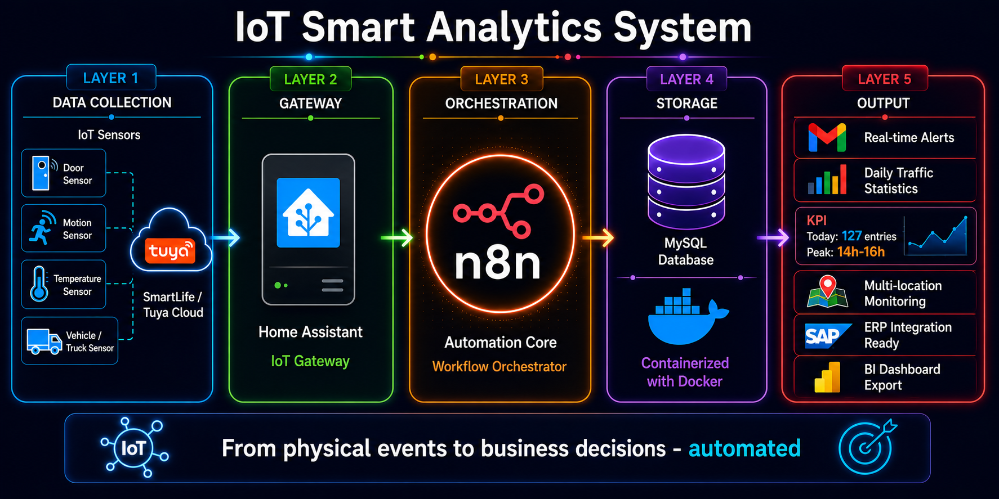

# IoT Smart Analytics System

Automated IoT event collection, real-time alerting and business decision support.
Built with n8n, Docker, MySQL, Home Assistant and Tuya.



---

## Project Purpose

Most businesses have physical events happening every day:
- Customers entering a store
- Workers accessing a warehouse zone
- Doors opening in a logistics facility

This system automatically captures these physical events from any IoT sensor,
stores them in a database, and transforms them into actionable business insights.

---

## Architecture

The system is built in 4 layers:

| Layer          | Technology              | Role                          |
|----------------|-------------------------|-------------------------------|
| IoT Sensors    | SmartLife / Tuya WiFi   | Capture physical events       |
| IoT Gateway    | Home Assistant OS       | Translate events to HTTP      |
| Orchestration  | n8n (core)              | Automate the entire pipeline  |
| Data & Alerts  | MySQL + Gmail           | Store, analyze and notify     |

### Data Flow

```
IoT Sensor (door, motion, temperature...)
        |
SmartLife / Tuya Cloud
        |
Home Assistant -- REST Command (HTTP POST)
        |
n8n Webhook  <-- ORCHESTRATION CORE
        |
MySQL INSERT --> store event
        |
MySQL SELECT --> retrieve for notification
        |
Gmail SMTP --> instant email alert
```

---

## n8n - The Heart of the System

n8n is the central orchestrator that connects all components.
No application code needed - just visual workflow nodes:

```
[Webhook] --> [MySQL INSERT] --> [MySQL SELECT] --> [Send Email]
```

Why n8n:
- Open source (fair-code) - free for internal use
- 400+ connectors: SAP, Slack, Teams, databases, APIs
- Visual workflow - easy to maintain and extend
- Self-hosted - data stays inside the company

---

## Containerization with Docker

The entire backend runs in Docker containers managed by Docker Compose:

```
docker-compose.yml
|-- n8n          --> Workflow automation engine  (port 5678)
|-- MySQL 8.0    --> Event data storage          (port 3306)
|-- phpMyAdmin   --> Database management UI      (port 8080)
```

Benefits:
- Deploy on any Linux server in minutes
- Isolated, reproducible environment
- Easy to scale or migrate

---

## Business Perspectives

With all events stored in MySQL, the system becomes a business intelligence foundation.

### Statistics Examples

```sql
-- Daily traffic count
SELECT DATE(created_at), COUNT(*) as entries
FROM door_events
GROUP BY DATE(created_at);

-- Peak hours analysis
SELECT HOUR(created_at) as hour, COUNT(*) as events
FROM door_events
GROUP BY HOUR(created_at)
ORDER BY events DESC;

-- Activity per location/device
SELECT device, COUNT(*) as total_events
FROM door_events
GROUP BY device;
```

### Use Cases by Industry

| Industry      | Application                                      |
|---------------|--------------------------------------------------|
| Retail        | Count daily customer entries, peak hours         |
| Logistics     | Monitor warehouse zone access                    |
| Smart Office  | Room occupancy statistics                        |
| Security      | Real-time intrusion alerts                       |
| Manufacturing | Track operator presence at workstations          |

---

## Tech Stack

| Technology        | Version  | Role                        |
|-------------------|----------|-----------------------------|
| n8n               | 2.x      | Workflow orchestration      |
| Docker            | 29.x     | Containerization            |
| Docker Compose    | v2       | Multi-container management  |
| MySQL             | 8.0      | Event data storage          |
| Home Assistant OS | 15.x     | IoT gateway                 |
| Tuya Developer API| -        | IoT device connectivity     |
| phpMyAdmin        | latest   | Database UI                 |
| Gmail SMTP        | -        | Email notifications         |
| AlmaLinux         | 9        | Docker host (VM on Proxmox) |
| Proxmox           | 8        | Hypervisor                  |

---

## Roadmap

- Door closing event tracking
- Daily summary email report (n8n Scheduler)
- Grafana dashboard for real-time visualization
- Multi-sensor support (motion, temperature, presence)
- SAP integration via n8n HTTP Request node
- Power BI / Power Automate connector
- REST API to expose statistics externally

---

## Requirements

- Proxmox 8+ or any Linux server
- Docker + Docker Compose
- Home Assistant OS
- Tuya Developer account (free - platform.tuya.com)
- Gmail account with App Password

---

## Author

Amine - IoT and Business Process Automation
"Bridging the physical world with business intelligence pipelines"

---

## License

MIT License - free to use and modify.
